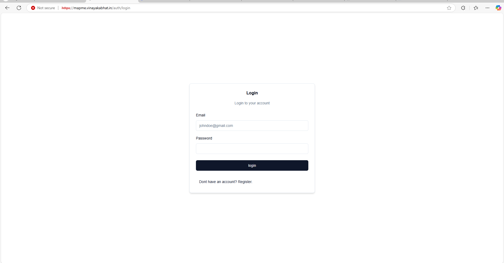
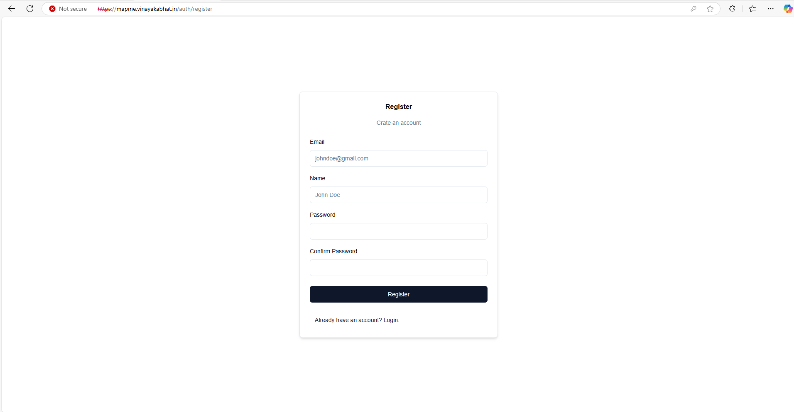
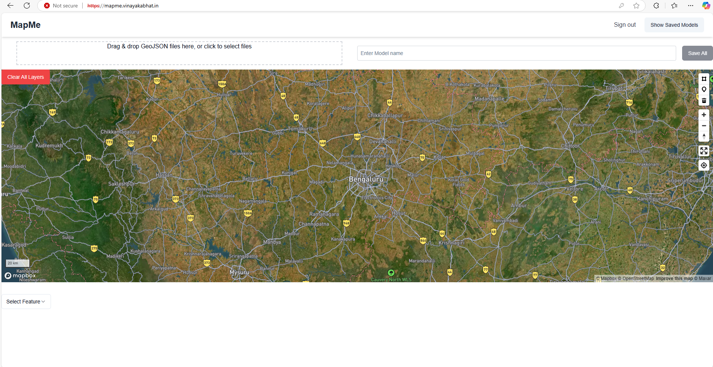
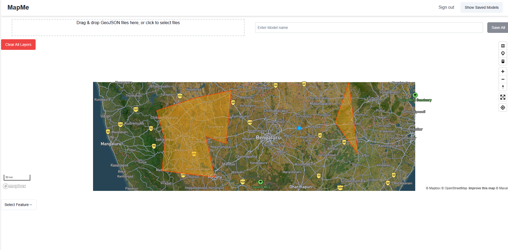
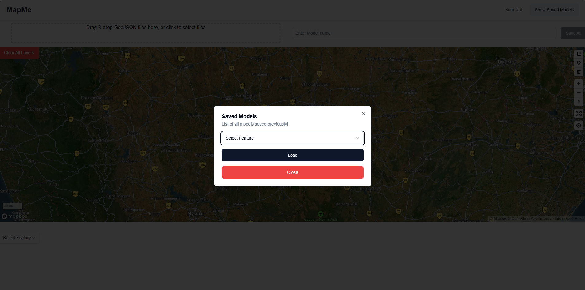
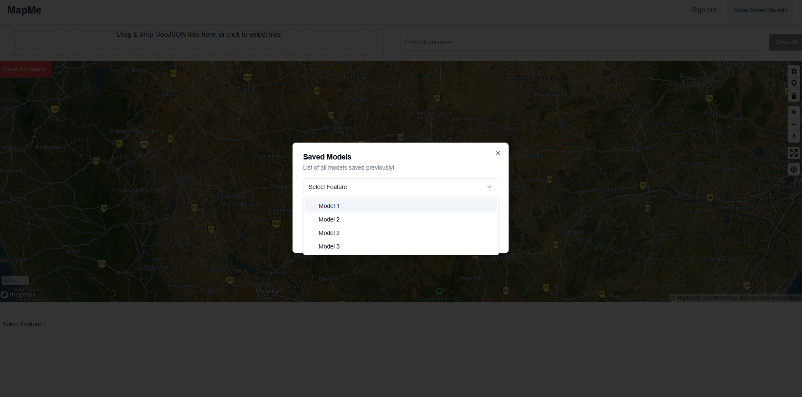

# Map Me

An application to perform the GIS Image interaction, Draw shapes and save it for further purposes

## Technologies Used

- Nextjs 
- Shadcn
- Mapbox Gl JS
- MongoDb
- Mongoose
- Typescript
- NodeJS
- Express
- Docker
- Kubernetes
- Google Cloud services (Kubernetes Cluster)
- Go Daddy(DNS)
- Skaffold

## Run Locally

Prerequisites

- Docker
- Enable kubernetes

Install ingress nginx based on your operating system or cloud env.
[click here](https://kubernetes.github.io/ingress-nginx/deploy/) to see official documentation.

Install Skaffold based on your operating system by following steps [skaffold](https://kubernetes.github.io/ingress-nginx/deploy/)

Once the above setup is done

Clone the project

```bash
  git clone https://github.com/vinayakbhat430/mapme
```

Go to etc/hosts file in your system (Considering windows).
[Reference](https://www.howtogeek.com/784196/how-to-edit-the-hosts-file-on-windows-10-or-11/)
and add a line at the end.
```
127.0.0.1 meet-sync.dev
```

Once done. Just cd to the cloned repository and run
```bash
skaffold dev
```

You are ready to run and use applications locally!
go to browser and enter
https://meet-sync.dev

If you encounter any warning Just follow this [Reference](https://stackoverflow.com/questions/35274659/when-you-use-badidea-or-thisisunsafe-to-bypass-a-chrome-certificate-hsts-err)


## Glimpse of application

- Login Page
  

- Register Page
  

- Map Screens
  
  

- Load data Screens
  
  